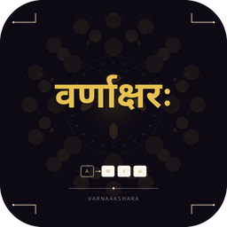

<div align="center">



# Varnaakshara

**Type in 12 Indian scripts using English transliteration.**<br>
Free, open-source, system-wide IME for Windows.

[](https://github.com/Exaggarate/Varnaakshara/releases)
[](https://github.com/Exaggarate/Varnaakshara/releases)
[](LICENSE)
[](https://varnaakshara.com)

[**Download**](https://github.com/Exaggarate/Varnaakshara/releases/download/v1.3.0/Varnaakshara_Setup_v1.3.0.exe) · [**Website**](https://varnaakshara.com) · [**How to Type**](https://varnaakshara.com/how-to-type.html) · [**Changelog**](https://varnaakshara.com/changelog.html)

<br>



</div>

---

## What is Varnaakshara?

Varnaakshara (वर्णाक्षर — "the essence of script") is a Windows IME that converts English transliteration into native Indian scripts in real time. Type `namaste` → get `नमस्ते`. It works **system-wide** — in every app where you can type.

```
namaste    →  नमस्ते      (Hindi)
vanakkam   →  வணக்கம்     (Tamil)
namaskAra  →  ನಮಸ್ಕಾರ     (Kannada)
namaskAram →  నమస్కారం    (Telugu)
namaskar   →  নমস্কার     (Bengali)
```

## Features

- ⌨️ **System-wide** — works in every Windows app (Word, Chrome, WhatsApp, VS Code, everything)
- ✈️ **100% Offline** — no internet required, no data sent anywhere
- ⚡ **Real-time** — instant keystroke-to-script conversion as you type
- 🪶 **Lightweight** — tiny footprint, no background services
- 🔒 **Private** — zero telemetry, zero analytics, your keystrokes never leave your machine
- 💡 **Smart suggestions** — learns from your typing over time (opt-in)
- 🎨 **Custom mappings** — define your own transliteration overrides
- 🕉️ **Vedic support** — svarita, anudatta, avagraha, Om symbol

## Supported Scripts

| Script | Languages | Example |
|--------|-----------|---------|
| Devanagari | Hindi, Marathi, Sanskrit, Nepali | नमस्ते |
| Kannada | Kannada | ನಮಸ್ಕಾರ |
| Tamil | Tamil | வணக்கம் |
| Telugu | Telugu | నమస్కారం |
| Malayalam | Malayalam | നമസ്കാരം |
| Bengali | Bengali | নমস্কার |
| Gujarati | Gujarati | નમસ્તે |
| Odia | Odia | ନମସ୍କାର |
| Gurmukhi | Punjabi | ਸਤ ਸ੍ਰੀ ਅਕਾਲ |
| Assamese | Assamese | নমস্কাৰ |
| Sinhala | Sinhala | ආයුබෝවන් |
| Thai | Thai | สวัสดี |
| Tibetan | Tibetan | བཀྲ་ཤིས་བདེ་ལེགས |

## Installation

1. Download [**Varnaakshara_Setup_v1.3.0.exe**](https://github.com/Exaggarate/Varnaakshara/releases/download/v1.3.0/Varnaakshara_Setup_v1.3.0.exe)
2. Run the installer (no admin required — installs to your user profile)
3. Press **F11** to activate, start typing

> **Note:** Windows SmartScreen may warn on first run — click "More info" → "Run anyway".

## Keyboard Shortcuts

| Key | Action |
|-----|--------|
| `F11` | Toggle IME on/off |
| `F12` | Cycle through languages |
| `Ctrl+1` through `Ctrl+=` | Quick-switch to a specific language |

## How It Works

Varnaakshara uses a greedy longest-match transliteration engine based on Baraha phonetic mapping:

- **Lowercase** = standard consonants: `k` → क, `g` → ग, `t` → त
- **Uppercase** = retroflex/aspirated: `T` → ट, `D` → ड, `N` → ण
- **Double vowels** = long form: `aa` → आ, `ee` → ई, `oo` → ऊ
- **Consonant clusters** = conjuncts: `kka` → क्क, `shri` → श्री

Full reference: [varnaakshara.com/how-to-type.html](https://varnaakshara.com/how-to-type.html)

## Part of Bharatiya Vidya Digital Mission

Varnaakshara is part of the **Bharatiya Vidya Digital Mission** — making India's linguistic heritage accessible and usable in the digital age. Every script matters. Every language deserves first-class digital support.

## Contributing

Found a bug or want a feature? [Open an issue](https://github.com/Exaggarate/Varnaakshara/issues).

## Contact

📧 bharatiyavidyadigitalmission@gmail.com

## License

[MIT](LICENSE) — free forever.
